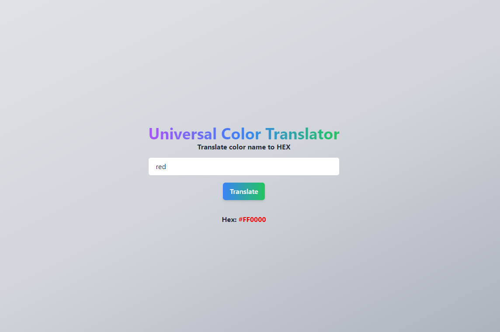
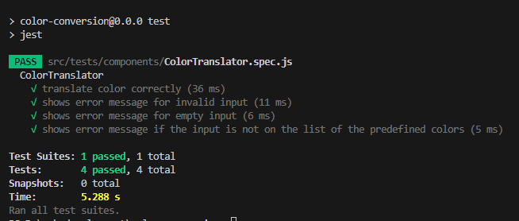

# Universal Color Translator

## Requirement
- Docker

## Setup
clone the repository  
`https://github.com/rowinsbie/universal-color-translator.git`
  
Navigate or open the terminal to the project directory   
`cd universal-color-translator/`

In the terminal of the project directory, run the following command to build the Docker image  
`docker build -t universal-color-translator .` 

Run the Docker container  
`docker run -p 8080:8080 universal-color-translator`

Go to your browser and visit  
`http://localhost:8080/`

## Overview
Universal Color Translator is simple standalone Vue.js application that allows users to translate color names to hexadecimal. 

### Tech Stack
 - Vue3
 - Tailwind
 - jest for unit test

### Key Features
  - Translate color names to hexadecimal values
  - Lightweight and fast performance

### Usage

1. Enter a color name in the input field.
2. Press Enter or click the "Translate" button.
3. The corresponding hexadecimal value will be displayed below the input field.

### Security
Universal Color Translator is a standalone application, so the only available attack surface is the input field, and no sensitive data or configuration that can be found or access using content discovery tools.

#### 1st layer
 - DOM Purify is implemented to prevent XSS
#### 2nd layer
 - Vue.js framework automatic HTML escaping using `{{}}`

## Guide for the test
Navigate or open the terminal to the project directory, and run the following command to run the test  
`npm test`

  
*Test result*

